# Adivinar el numero

Introduce un numero y te dirá si el numero elegido es mayor o menor al aleatorio.
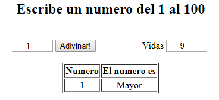

[Adivinar numero](https://github.com/ComandPromt/JS/blob/master/adivinar_numero_js.html)

# 3 y 4 en raya

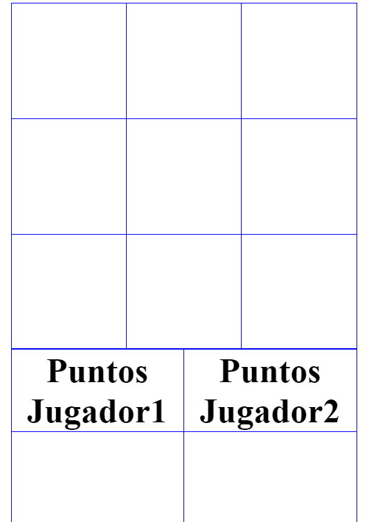

[3 y 4 en raya](https://github.com/ComandPromt/Juegos/tree/master/3_4_en_raya)

# Sudoku

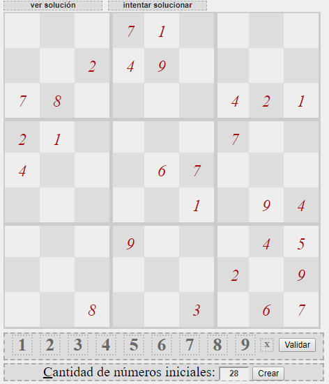

[1](https://github.com/ComandPromt/Juegos/tree/master/yasminoku)
[2](https://github.com/ComandPromt/Juegos/tree/master/Sudoku%20-%20Jar)

# Whack A Mole

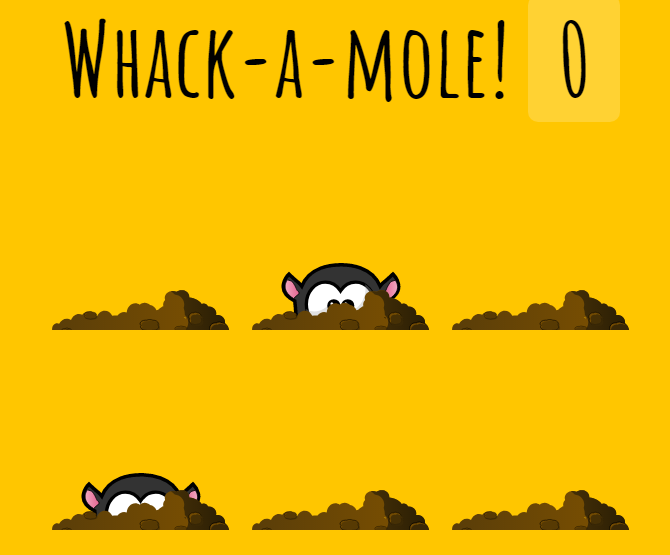

[Whack A Mole](https://github.com/ComandPromt/Juegos/tree/master/Whack%20A%20Mole)

# Buscaminas

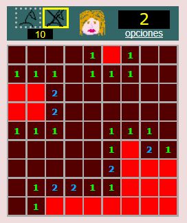

[Buscaminas](https://github.com/ComandPromt/Juegos/tree/master/buscaminas)

# 4 en linea

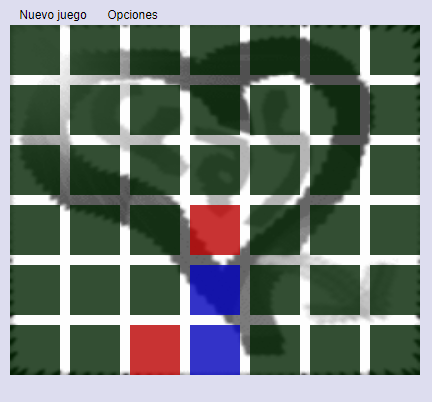

[4 en linea](https://github.com/ComandPromt/Juegos/tree/master/conectayas)

# Hundir la flota

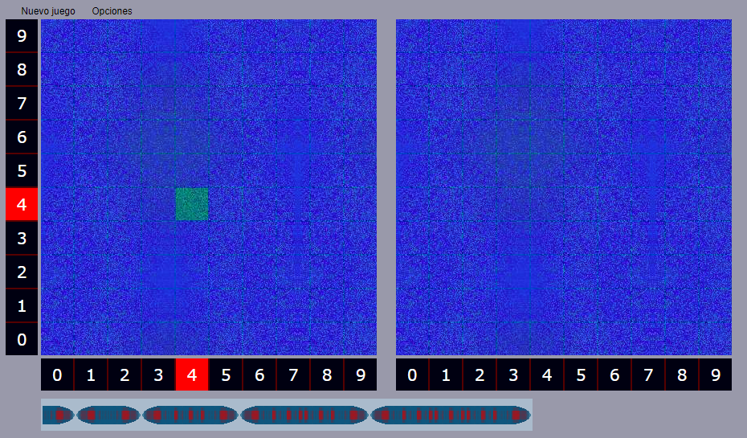
[Hundir la flota](https://github.com/ComandPromt/Juegos/tree/master/hundir_la_flota)

# Navecitas

[Navecitas](https://github.com/ComandPromt/Juegos/tree/master/navecitas/navecitas)

# Palas

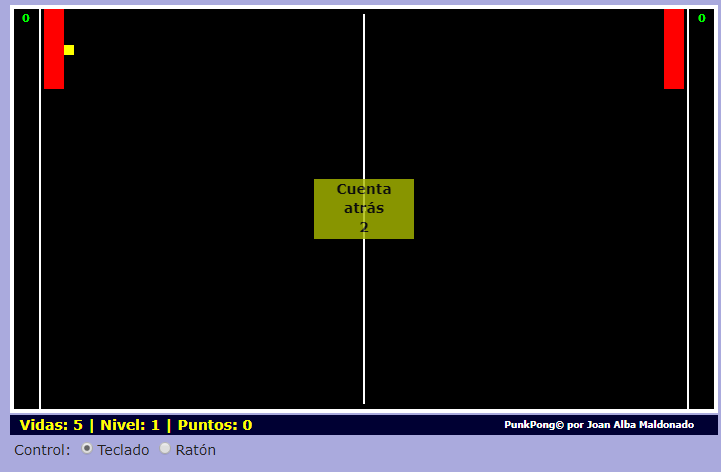

[Palas](https://github.com/ComandPromt/Juegos/tree/master/punkpong)

# Ranisima

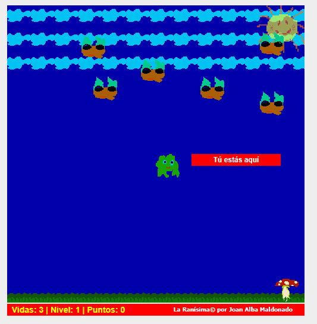

[Ranisima](https://github.com/ComandPromt/Juegos/tree/master/ranisima)

# Tetris

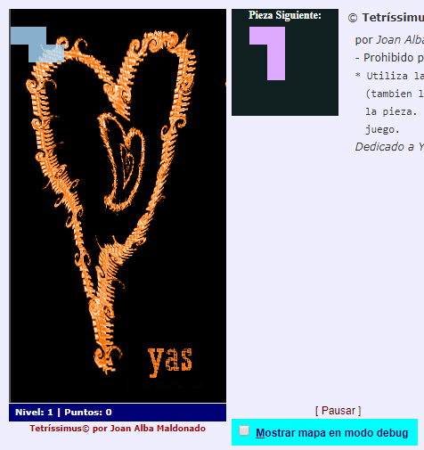

[Tetris](https://github.com/ComandPromt/Juegos/tree/master/tetrissimus)

# Laberinto

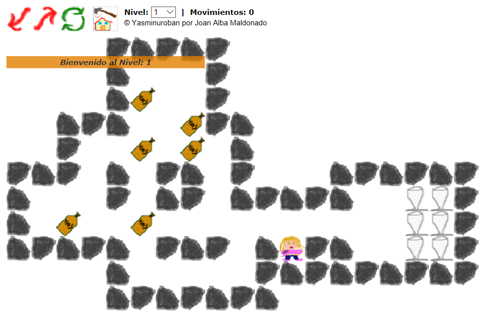
[Laberinto](https://github.com/ComandPromt/Juegos/tree/master/yasminuroban)
